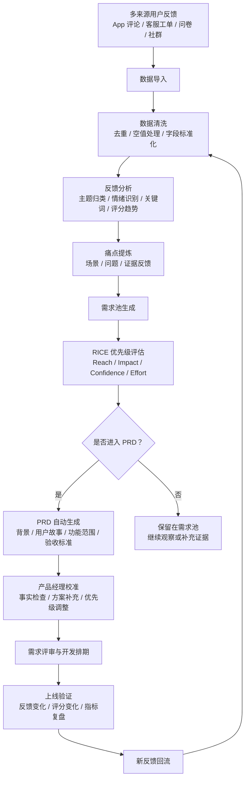

# 产品流程图

```mermaid
flowchart TD
    A["多来源用户反馈<br/>App 评论 / 客服工单 / 问卷 / 社群"] --> B["数据导入"]
    B --> C["数据清洗<br/>去重 / 空值处理 / 字段标准化"]
    C --> D["反馈分析<br/>主题归类 / 情绪识别 / 关键词 / 评分趋势"]
    D --> E["痛点提炼<br/>场景 / 问题 / 证据反馈"]
    E --> F["需求池生成"]
    F --> G["RICE 优先级评估<br/>Reach / Impact / Confidence / Effort"]
    G --> H{"是否进入 PRD？"}
    H -- "是" --> I["PRD 自动生成<br/>背景 / 用户故事 / 功能范围 / 验收标准"]
    H -- "否" --> J["保留在需求池<br/>继续观察或补充证据"]
    I --> K["产品经理校准<br/>事实检查 / 方案补充 / 优先级调整"]
    K --> L["需求评审与开发排期"]
    L --> M["上线验证<br/>反馈变化 / 评分变化 / 指标复盘"]
    M --> N["新反馈回流"]
    N --> C
```

## 闭环说明

该流程强调 AI 在产品工作中的辅助角色：AI 帮助产品经理更快完成信息提炼、需求结构化和 PRD 草稿生成；产品经理负责业务判断、优先级取舍和最终方案质量。
